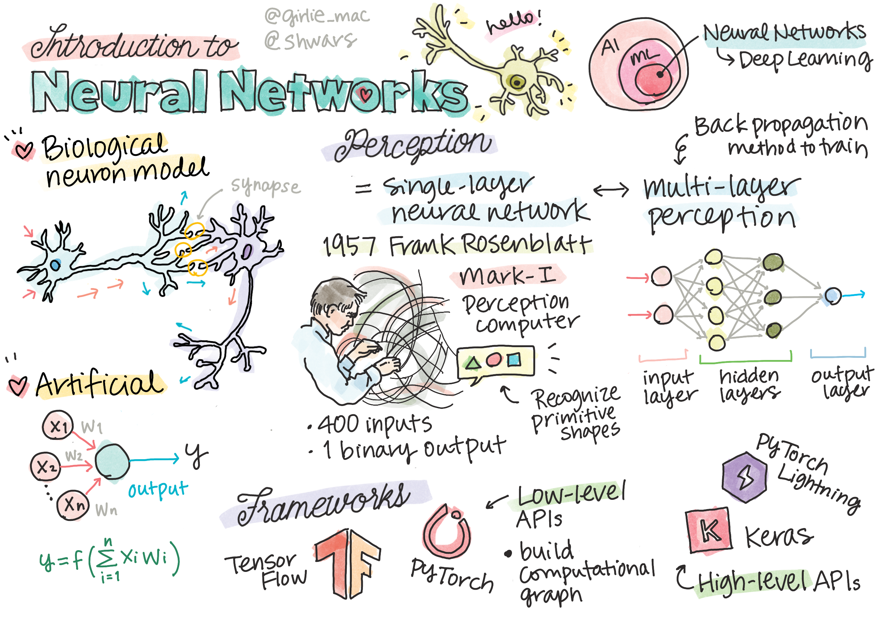

# 第 2 阶段 · 深度学习与 Transformer

> 目标:能从零写出 Attention,理解为什么 Transformer 能取代 RNN。

## 这个阶段解决什么

大模型的核心是 Transformer。但直接啃 Transformer 会一头雾水 —— 你得先懂反向传播、计算图,再懂 CNN/RNN 的局限,才能理解为什么 Attention 是一次范式跃迁。本阶段把这些串成一条因果链。

## 学习目标

- [ ] 能从零写出反向传播(micrograd 级别)
- [ ] 理解 CNN(局部连接)和 RNN(时序依赖)各自解决什么
- [ ] 能手写 Scaled Dot-Product Attention
- [ ] 说清 Multi-Head 为什么要多头
- [ ] 理解位置编码为什么必要

## 本阶段章节

- [反向传播与计算图](01-nn.md)
- [CNN 与 RNN](02-cnn-rnn.md)
- [Transformer 结构详解](03-transformer.md)

## 🎯 面试高频考点(本阶段)

| 考点 | 难度 | 说明 |
|------|------|------|
| 手写 Attention | ★★★ | 高频手撕题 |
| QKV 的直觉 | ★★★ | 数据库检索类比 |
| 为什么除以 √dₖ | ★★ | 防 softmax 饱和 |
| Multi-Head 的作用 | ★★ | 不同子空间学不同模式 |
| Causal Mask | ★★ | Decoder 上三角屏蔽 |
| 反向传播链式法则 | ★★ | 给个计算图让你推 |

## 📂 简历项目建议

- **从零实现 mini-GPT**(参考 nanoGPT),在莎士比亚数据集上训练
- **可视化 Attention 权重**,观察不同层关注的模式

---

> ⏳ 正文编写中。本导览页已就绪,子页面内容将逐步填充。
