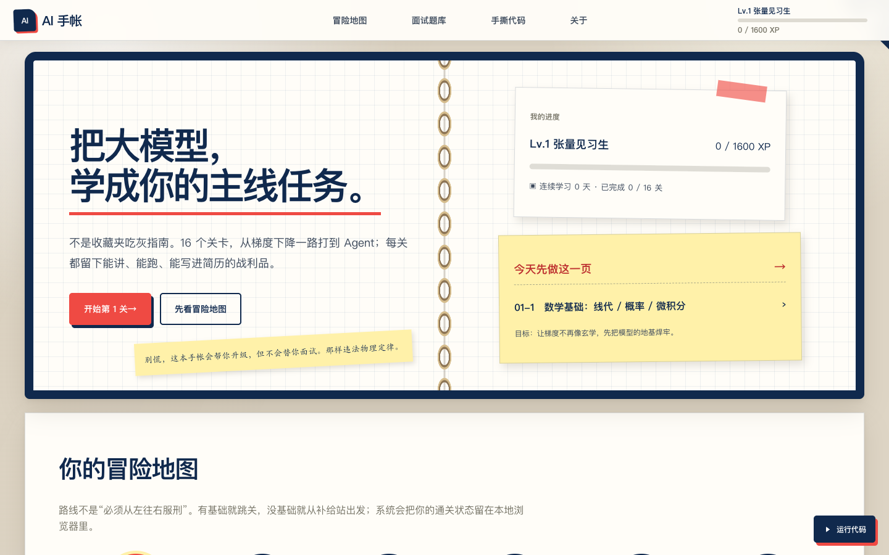
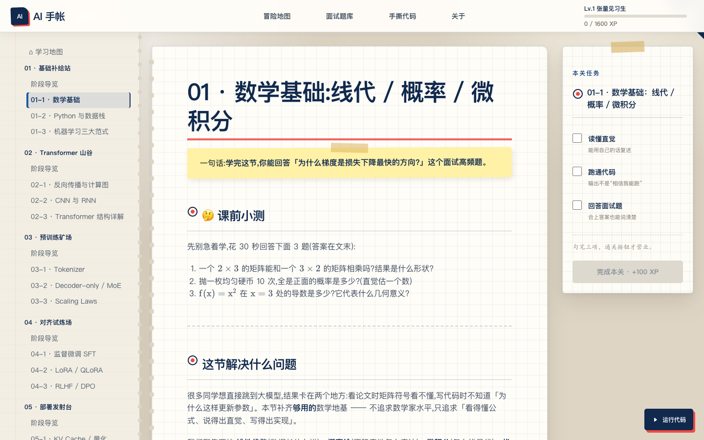
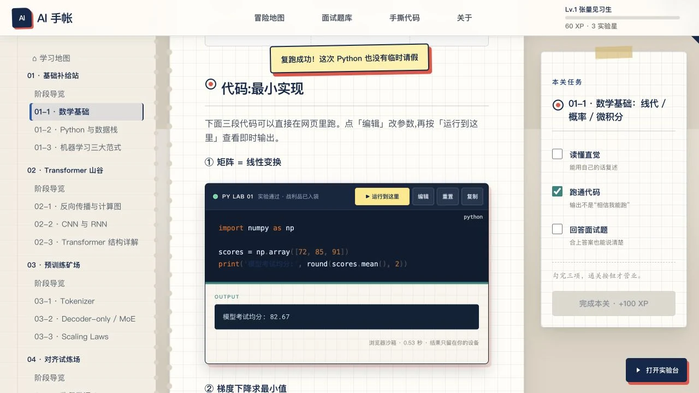

<div align="center">

# AI 手帐

### 把大模型，学成你的主线任务。

一份面向中文学习者与求职者的「可通关」大模型工程教程。<br>
从数学地基、Transformer、预训练与对齐，一路打到 RAG、Agent、部署和 MCP。

[](https://yuanyuanma03.github.io/ai-to-llm-engineer/)
[](https://yuanyuanma03.github.io/ai-to-llm-engineer/quiz/)
[](#学习路线)
[](#)

**[开始学习](https://yuanyuanma03.github.io/ai-to-llm-engineer/)** · **[打开面试题库](https://yuanyuanma03.github.io/ai-to-llm-engineer/quiz/)** · **[练习手撕代码](https://yuanyuanma03.github.io/ai-to-llm-engineer/#/hand-coding)**

</div>

<a href="https://yuanyuanma03.github.io/ai-to-llm-engineer/">
  
</a>

> 不是资源链接农场，也不是“看完等于学会”的电子安慰剂。这里把知识拆成关卡，把练习变成任务，把每次真正掌握变成可以盖章的进度。

## 为什么是一本「AI 手帐」

学习大模型最容易出现一种幻觉：收藏了 47 篇文章，于是感觉自己已经懂了 47 篇。AI 手帐想做的，是把这种“知识囤积”改造成一条有输入、有动作、有验收的工程路线。

| 你会得到 | 网页里如何实现 |
|---|---|
| **一条完整路线** | 6 个阶段、16 个课程关卡，从数学基础到 MCP |
| **真实学习反馈** | 任务清单、XP、实验星、等级、连续学习天数与通关印章 |
| **能跑的工程练习** | 浏览器内 Python 实验台、即时输出/报错/图表与 10 道手撕代码题 |
| **能讲清的面试能力** | 高频追问、易错点、31 道随机题卡与掌握度自评 |
| **能写进简历的证据** | 每阶段都给出项目方向、交付物与验收口径 |

## 网页里有什么

### 课程不是文章列表，而是一张可推进的任务地图

- 首页会根据本地进度推荐下一关，不用每天重新思考“我该学什么”。
- 每关必须完成「读懂直觉 / 跑通代码 / 回答面试题」三项任务才能盖章。
- XP、等级、通关状态和连续学习天数保存在浏览器本地，无需注册账号。
- 所有课程都有上一关 / 下一关导航，学到一半不会掉进链接迷宫。

<a href="https://yuanyuanma03.github.io/ai-to-llm-engineer/#/01-fundamentals/01-math">
  
</a>

### 代码不再负责“看起来能跑”

每个 Python 代码块都是一格真正的迷你实验室：可以直接编辑、重置和运行。标准库、NumPy、Matplotlib 等代码在浏览器的独立线程中执行，页面不会因为一段计算当场失去意识；输出、异常和图表会原地回贴到手帐。

<a href="https://yuanyuanma03.github.io/ai-to-llm-engineer/#/01-fundamentals/01-math">
  
</a>

- 点「运行到这里」会自动补跑本页上方的兼容代码块，跨格变量不会突然失忆。
- 首次运行按需加载 Python 与科学计算包；之后复跑通常只需数秒。
- 跑通后自动勾选本关「跑通代码」，首次胜利获得 `+20 XP` 和一颗实验星。
- 无限循环会触发急停；错误会变成可读的 Bug Boss 面板，而不是一堵红色天书。
- PyTorch、Transformers、MCP Server 等重型或服务端依赖会明确标记为「云端关卡」，仍可编辑和复制，不会假装浏览器什么都能炼。

### 每一关都有明确的学习闭环

```text
课前摸底  →  直觉解释  →  公式与最小实现  →  易错点
    →  面试追问  →  简历项目  →  挑战任务  →  课后验收
```

内容参考 Microsoft AI-For-Beginners 的教学闭环，并围绕大模型工程师岗位重新组织：不只告诉你“这是什么”，还要回答“为什么这样设计、怎么跑通、面试怎么问、最终留下什么证据”。

## 学习路线

| 阶段 | 关卡 | 最终战利品 |
|---|---|---|
| **01 · 基础补给站** | [数学基础](https://yuanyuanma03.github.io/ai-to-llm-engineer/#/01-fundamentals/01-math) · [Python 与数据栈](https://yuanyuanma03.github.io/ai-to-llm-engineer/#/01-fundamentals/02-python) · [机器学习范式](https://yuanyuanma03.github.io/ai-to-llm-engineer/#/01-fundamentals/03-ml-basics) | 看懂公式，写出向量化实现，讲清训练与评估 |
| **02 · Transformer 山谷** | [反向传播](https://yuanyuanma03.github.io/ai-to-llm-engineer/#/02-deep-learning/01-nn) · [CNN / RNN](https://yuanyuanma03.github.io/ai-to-llm-engineer/#/02-deep-learning/02-cnn-rnn) · [Transformer](https://yuanyuanma03.github.io/ai-to-llm-engineer/#/02-deep-learning/03-transformer) | 手写 Attention，解释计算图与架构取舍 |
| **03 · 预训练矿场** | [Tokenizer](https://yuanyuanma03.github.io/ai-to-llm-engineer/#/03-pretraining/01-tokenizer) · [Decoder-only / MoE](https://yuanyuanma03.github.io/ai-to-llm-engineer/#/03-pretraining/02-architecture) · [Scaling Laws](https://yuanyuanma03.github.io/ai-to-llm-engineer/#/03-pretraining/03-scaling-laws) | 拆开现代 LLM 的发动机舱，算清数据与算力配比 |
| **04 · 对齐试炼场** | [SFT](https://yuanyuanma03.github.io/ai-to-llm-engineer/#/04-finetuning/01-sft) · [LoRA / QLoRA](https://yuanyuanma03.github.io/ai-to-llm-engineer/#/04-finetuning/02-peft) · [RLHF / DPO](https://yuanyuanma03.github.io/ai-to-llm-engineer/#/04-finetuning/03-alignment) | 用更少显存完成微调，解释偏好对齐的工程逻辑 |
| **05 · 部署发射台** | [推理优化](https://yuanyuanma03.github.io/ai-to-llm-engineer/#/05-deployment/01-inference) · [RAG](https://yuanyuanma03.github.io/ai-to-llm-engineer/#/05-deployment/02-rag) · [Agent](https://yuanyuanma03.github.io/ai-to-llm-engineer/#/05-deployment/03-agent) | 构建能检索、能调用工具、能被评估的 LLM 应用 |
| **06 · 前沿观测站** | [MCP 工具接入协议](https://yuanyuanma03.github.io/ai-to-llm-engineer/#/06-frontier/01-mcp) | 给 Agent 的工具箱装上统一接口 |

## 三种打开方式

### 完全小白

从 [01-1 数学基础](https://yuanyuanma03.github.io/ai-to-llm-engineer/#/01-fundamentals/01-math) 开始，按地图推进。别急着跳到 Agent——地基不会因为你很有热情就自动出现。

### 已有机器学习基础

从 [Transformer 结构详解](https://yuanyuanma03.github.io/ai-to-llm-engineer/#/02-deep-learning/03-transformer) 开始，用每关的面试追问快速查漏补缺。

### 正在准备面试

直接进入 [面试试炼场](https://yuanyuanma03.github.io/ai-to-llm-engineer/quiz/) 和 [手撕代码题合集](https://yuanyuanma03.github.io/ai-to-llm-engineer/#/hand-coding)，先答题，再回到对应关卡补洞。

## 本地运行

项目基于 Docsify，无需安装依赖或执行构建：

```bash
git clone https://github.com/YuanyuanMa03/ai-to-llm-engineer.git
cd ai-to-llm-engineer
python3 -m http.server 3000
```

浏览器访问 `http://localhost:3000`。学习进度与实验星仅写入浏览器 `localStorage`，代码在本机浏览器的 Web Worker 中执行，不会上传到本项目的服务器。首次运行需要联网从 CDN 加载 Pyodide 与所需科学计算包。

维护者可以额外运行零依赖检查：

```bash
npm run check
npm test
```

## 内容与技术

- **教学结构**：课前摸底、直觉解释、可运行实验、课后测验与求职验收。
- **前端实现**：Docsify、原生 JavaScript、CSS、KaTeX、Prism、[Pyodide](https://pyodide.org/) Web Worker。
- **参考项目**：[Microsoft AI-For-Beginners](https://github.com/microsoft/AI-For-Beginners)；部分手绘知识图来自该项目，并保留来源说明。
- **原创范围**：围绕大模型工程师求职重新规划的中文课程、工程实践、面试追问、手撕代码与游戏化学习系统，并非原项目的逐章翻译。

## 一起把它写得更好

- 发现知识或代码错误：欢迎提交 Issue，或通过课程页底部直接定位源文件。
- 想补充课程：请沿用 [写作模板](TEMPLATE.md)，保证有输入、实验与验收。
- 遇到新的面试题：欢迎在 [Discussions](https://github.com/YuanyuanMa03/ai-to-llm-engineer/discussions) 投稿。

<div align="center">

如果这本手帐帮你少走了一点弯路，欢迎点一颗 Star。<br>
收藏不能替你学习，但 Star 可以提醒作者继续更新。⭐

**[现在开始第 1 关 →](https://yuanyuanma03.github.io/ai-to-llm-engineer/#/01-fundamentals/01-math)**

</div>
